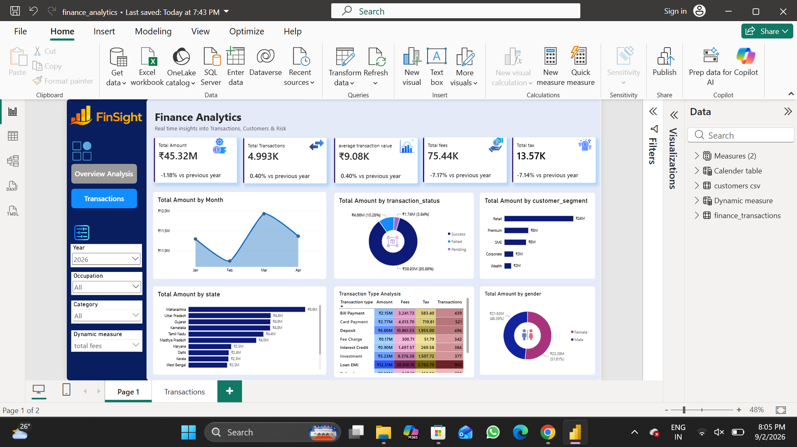
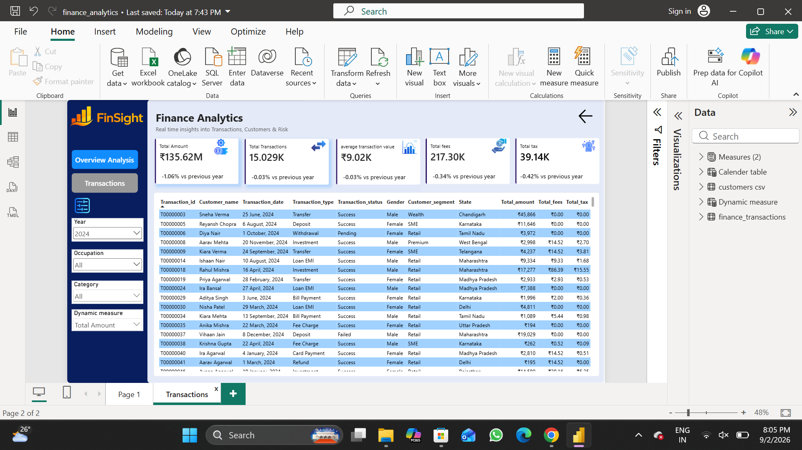

# 📊 Finance Analytics Dashboard — FinSight

A Power BI dashboard that delivers real-time insights into financial **transactions, customers, and risk** — built to help finance teams monitor volume, fees, tax, and transaction health across regions, segments, and channels.



## 🔍 Overview

FinSight is an interactive Power BI report covering two linked datasets — customer profiles and transaction records — modeled together with a calendar table to enable time-intelligence analysis (YoY comparisons, monthly trends, etc.).

The report has two pages:

1. **Overview Analysis** — high-level KPIs and trends across the full transaction base
2. **Transactions** — a detailed, filterable transaction-level table with the same KPI cards for drill-down

## ✨ Key Features

- **KPI cards**: Total Amount, Total Transactions, Average Transaction Value, Total Fees, Total Tax — each with a year-over-year % change indicator
- **Trend analysis**: Total Amount by Month (line chart)
- **Status breakdown**: Total Amount by Transaction Status (Success / Failed / Pending) via donut chart
- **Segment analysis**: Total Amount by Customer Segment (Retail, Premium, SME, Corporate, Wealth)
- **Geographic breakdown**: Total Amount by State (bar chart)
- **Transaction type analysis**: matrix of Amount, Fees, Tax, and Transaction count by type (Bill Payment, Card Payment, Deposit, Fee Charge, Interest Credit, Investment, Loan EMI, etc.)
- **Demographic split**: Total Amount by Gender
- **Dynamic measure selector**: switch the underlying measure (Total Amount, Total Fees, etc.) driving the visuals via a field-parameter slicer
- **Filters**: Year, Occupation, and Category slicers apply across the report
- **Drill-through**: detailed row-level transaction table on page 2 with the same filter context



## 🗂️ Data Model

| Dataset | Rows | Description |
|---|---|---|
| `customers.csv` | ~5,000 | Customer master data — demographics, location, occupation, segment, and income |
| `finance_transactions.csv` | ~50,000 | Transaction-level records — amount, fees, tax, channel, status, and risk score |

**customers.csv** columns: `customer_id`, `first_name`, `second_name`, `gender`, `date_of_birth`, `city`, `state`, `occupation`, `customer_segment`, `annual_income`, `join_date`

**finance_transactions.csv** columns: `transaction_id`, `transaction_date`, `account_id`, `customer_id`, `transaction_type`, `channel`, `merchant_category`, `amount`, `fee_amount`, `tax_amount`, `currency`, `transaction_status`, `is_fraud`, `risk_score`, `reference_no`

The two tables are related via `customer_id`, with a separate **Calendar** table supporting time-intelligence (YoY) DAX measures.

## 🛠️ Tools & Techniques

- **Power BI Desktop** — report design and data modeling
- **Power Query** — data cleaning and transformation
- **DAX** — dynamic measures, YoY comparisons, field parameters
- **Star-schema modeling** — customers + transactions + calendar table

## 📁 Repository Structure

```
Finance_Analytics/
├── finance_analytics.pbix       # Power BI report file
├── customers.csv                 # Customer dataset
├── finance_transactions.csv      # Transactions dataset
├── screenshots/
│   ├── overview.png
│   └── transactions.png
└── README.md
```

## 🚀 How to Use

1. Clone this repository
2. Open `finance_analytics.pbix` in [Power BI Desktop](https://powerbi.microsoft.com/desktop/) (free)
3. If prompted, update the data source file paths to point to `customers.csv` and `finance_transactions.csv` in this repo
4. Click **Refresh** to load the data
5. Explore the report using the Year, Occupation, Category, and Dynamic Measure filters

## 📌 Notes

- Currency is in INR (₹).
- Data in this repository is for demonstration/portfolio purposes.

## 📬 Contact

Feel free to reach out with questions or feedback about this project.
